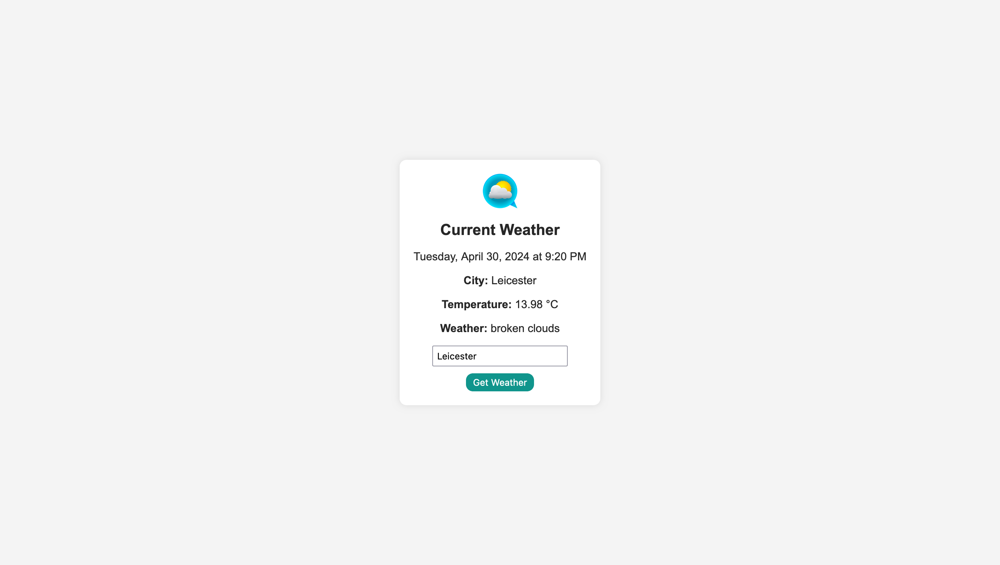

# Weather App

This is a simple weather application built with HTML, CSS, and JavaScript that fetches and displays the current weather information for a given city using the OpenWeatherMap API.



## Features

- Enter a city name to get the current weather information
- Displays the city name, temperature (in Celsius), and weather description
- Shows the current date and time
- Error handling for invalid city names or failed API requests

## Getting Started

### Prerequisites

To run this application, you need to have a web browser installed on your machine.

### Installation

1. Clone the repository or download the source code files.
2. Open the `index.html` file in your web browser.

### API Key

This application uses the OpenWeatherMap API to fetch weather data. You need to obtain an API key from [OpenWeatherMap](https://openweathermap.org/) and replace `'YOUR_API_KEY_HERE'` in the `index.js` file with your actual API key.

```javascript
const API_KEY = "YOUR_API_KEY_HERE";
```
## Usage

1. Open the index.html file in your web browser.
2. Enter a city name in the input field.
3. Click the "Get Weather" button or press Enter.
4. The application will display the current weather information for the entered city, including the city name, temperature, and weather description.
5. The current Local date and time will be shown.

## Technologies Used

- HTML
- CSS
- JavaScript

## Contributing
Contributions are welcome! If you find any issues or have suggestions for improvements, please open an issue or submit a pull request.
